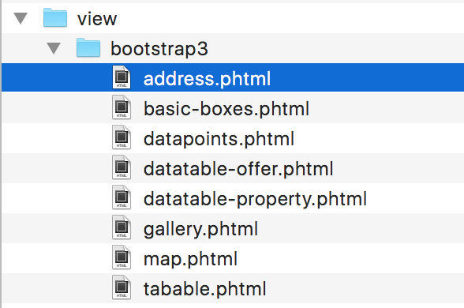
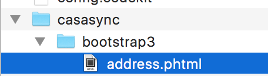
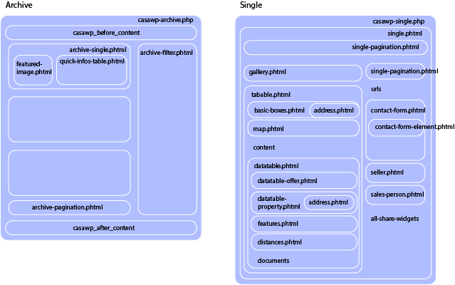

readme.txt
===============================

Please refer to the ``readme.txt`` for general infos concerning the plugin. This readme.md only contains further technical details.

How do I change the html markup and add my own view files?
-------------------------------

Simply copy the relevant view files from the plugin ``/wp-content/plugins/casawp/theme-defaults/chosen-viewtype/*.phtml`` ...



into your theme directory ``/wp-content/themes/your-theme/casawp/chosen-viewtype/*.phtml`` ...



to override them with your theme.

ViewFile Structure
-------------------------------



Shortcodes
===============================

casawp_properties
-------------------------------

`[casawp_properties categories="apartment" order="ASC" posts_per_page="15"]`

Displays properties anywhere shortcodes are accepted.

The correspondig view file `shortcode-properties.phtml` is responsible for the looks.

Accepted Query Params:

* 'post-type'
* 'posts_per_page'
* 'order'
* 'ignore_sticky_posts'
* 'post__not_in'
* 'orderby'
* 'categories'
* 'locations'
* 'salestypes'
* 'availabilities'
* 'categories_not'
* 'locations_not'
* 'salestypes_not'
* 'availabilities_not'
* 'features'
* 'my_lng'
* 'my_lat'
* 'radius_km'
* 'projectunit_id'

Accepted pass-through variables

* col_count

casawp_contactform
-------------------------------

`[casawp_contactform offer_id="12" id="my-custom-form"]`

Displays a form for inquiry submissions

Accepted Query Params:

* id – Form ID registered to formSettingService (optional)
* offer_id
* project_id
* direct_recipient_email (Will override any setting and will force CASAMAIL to send an E-Mail)

Custom Forms
===============================

Register additional forms in your theme by adding the following to your functions.php

```php
<?php

    //create a new class that extends DefaultFormSettings to create a new form id.
    class MyCustomFormSetting extends \casawp\Form\DefaultFormSetting {
        public $id = 'my-custom-form';

        function __construct(){
            //name the view file you wish to use (defaults to contact-form) make sure you create the file in `wp-content/themes/your-theme/casawp/bootstrap3/{viewFileName}.phtml`
            $this->viewFile = 'custom-form-' . $this->id;
        }

        public function setAdditionalFields($form){
            // set additional fields here
            $form->add(array(
                'name' => 'customfield',
                'type' => 'Text',
                'options' => array(
                    'label' => __('Custom Field here', 'casawp'),
                ),
            ));

            //add validation filters here
            $form->setCustomFilters(array(
                array(
                    'name' => 'customfield',
                    'required' => true,
                    'validators' => array(
                        array(
                            'name' => 'not_empty',
                        ),
                        array(
                            'name' => 'string_length',
                            'options' => array(
                                'min' => 2
                            ),
                        ),
                    ),
                )
            ));

            return $form;
        }
        public function preCasaMailFilter($data, $postdata){
            //manipulate the data before it is sent to casamail after the visitor posts the form and it's valid.
            $data['extra_data'] = array_merge($data['extra_data'], array('customfield' => $postdata['customfield']));

            return $data;
        }
    }

    //make sure the plugin knows about it by informing the formSettingService from the plugin
    add_action( 'casawp_register_forms', 'casawp_register_forms_func', 10, 1 );
    function casawp_register_forms_func( $formSettingService ) {
        $formSettingService->addFormSetting(new MyCustomFormSetting());
    }
```


Custom automatic E-Mail Response
===============================

An example of how to enable an extra E-Mail when a customer posts a inquiry.

```php
function casawp_after_inquirysend($payload) {
	//(array) $postdata
	//(object) $offer
	extract($payload);

	if ($offer->getFieldValue('seller_org_customerid') == "bento") {

		$subject = "Info-Meldung bezüglich einer Objekt-Anfrage von zueriimmo.ch: " . $offer->getTitle();

		$message = 'Eine Anfrage wurde von zueriimmo.ch an die Bento AG gesendet.';
		$message .= "\n";
		$message .= "\n";
		$message .= "Objekt:\n";
		$message .= $offer->getTitle(). "\n";
		$message .= 'ref: ' . $offer->getFieldValue('visualReferenceId')
        ? $offer->getFieldValue('visualReferenceId')
        : $offer->getFieldValue('referenceId') . "\n";

        $message .= "\n";
		$message .= "\n";
		$message .= "Anfragender:\n";
		foreach ($postdata as $key => $value) {
			$message .= $key . ": " . $value . "\n";
		}

		wp_mail( 'jstalder@icloud.com, info@zueriimmo.ch', $subject, $message);
	}
}
add_action( 'casawp_after_inquirysend', 'casawp_after_inquirysend' );
```


Exclusive Properties with login
===============================

The Plugin uses the default WordPress user interface for registration and authentication for users that have access to special unpublished properties. These properties `if availability = private` and the corresponding filter `if availability contains private`, will only be viewable if the user is registered to at least a `subscription` level and will be redirected to the defined login page.

CASAWP will generate 2 Pages directly and will define the pages within the casawp->settings->PrivateArea login and logout pages.

Custom Login form at arbitrary entry location
-------------------------------

Use the default WordPress login form `wp_login_form()` or copy the sample code below. (adjust the redirect url to an appropriate one)

```php
<?php if (isset($_GET['login']) && $_GET['login'] == 'failed') : ?>
  <div class="alert alert-danger" role="alert">Login fehlgeschlagen.</div>
<?php endif; ?>
<div class="casawp-private-login-form">
  <?php
    $args = array(
      'echo'           => true,
      'remember'       => true,
      'redirect'       => 'http://where-should-i-go.com',
    );
    wp_login_form($args);
  ?>
</div>
```
