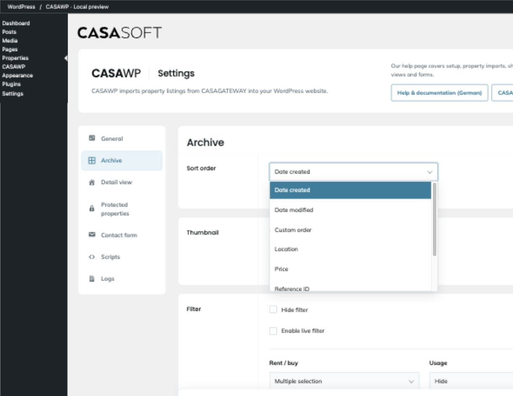

readme.txt
===============================


Please refer to the ``readme.txt`` for general infos concerning the plugin. This readme.md only contains further technical details.

Settings page
===============================

Open **CASAWP** in the WordPress admin menu to configure General, Archive, Detail view, Protected properties, Contact form, Scripts, and Logs. The settings page uses a responsive sidebar, grouped cards, and a sticky **Save changes** bar. The layout supports widths up to 1920 px; on smaller screens, navigation wraps above the form and fields stack vertically. The introduction has flexible space, with help and GitHub links alongside it or underneath when space is limited.

The CASASOFT logo above the settings links to [casasoft.ch](https://casasoft.ch/) in a new tab. All archive filters, including their display types and manual room/area ranges, share one card. **Show net rent** appears in the **Price** section. On this page, third-party callbacks on the WordPress admin notice hooks are suppressed before rendering; CASAWP and WordPress core callbacks are retained. A scoped stylesheet and script hide standard notices unless marked with `casawp-notice`, including banners that force inline `display: block !important`. CASAWP's settings confirmations, import results, deletion confirmations, and generated-page messages remain visible; other admin screens are unaffected. This also covers standard notices inserted later by another plugin. Existing option keys and tab URLs are retained, and settings labels are available in German, English, French, and Italian.

Titles use Poppins and body text uses Mulish, with CASASOFT-inspired blue buttons, subtle field backgrounds, and visible focus indicators. Both fonts are bundled locally with their licenses and loaded only on the CASAWP settings page; viewing settings makes no requests to Google Fonts. Code fields retain a monospace font. Section titles sit inside the first white card, aligned with the white navigation panel. Text inputs and textareas share a maximum width of 400 px. Custom checkboxes use the button blue with a white checkmark, and the sticky bottom bar contains only the save action. The delete-all action uses a solid red button with white text. All settings dropdowns use a locally bundled Select2 theme with matching blue focus and selection states, keyboard navigation, and search for lists of ten or more options. The original select fields and saved values are retained, with native dropdowns available if JavaScript fails. The library uses a private jQuery registration to avoid replacing another plugin’s Select2. Menus close on outside clicks. A head-loaded pending state prevents native dropdowns flashing during tab navigation; it clears after initialization or restores native controls automatically if enhancement fails.



Verify settings changes in a local or staging WordPress installation. External CASAGATEWAY, Google Maps, reCAPTCHA, and email delivery require separate integration testing with configured services.

Settings saves require an administrator's verified POST request and accept only the fields on the selected tab, including registered custom categories and displayed content languages. AJAX import start, cancellation and progress reset require administrator permissions, POST and an action-specific nonce in the `nonce` field (`casawp_start_import`, `casawp_cancel_import` or `casawp_reset_import_progress`). The settings UI supplies these nonces for its controls. Public gateway pokes and scheduled imports keep their existing integration paths. Stored form values are escaped for their HTML context so quoted text and HTML wrappers remain editable. Submitted values are unslashed once; the HTML wrapper and tracking settings retain the legacy slash format expected by existing frontend readers, and tracking preserves the `%casawp_id%` placeholder.

Import feed safety
===============================

CASAWP validates the XML structure and every property ID before changing existing listings or scheduling deletion work. A feed must have exactly one direct `properties` node, containing only `property` elements with nonblank IDs. Wrapper names and imported IDs are preserved. An explicit empty `properties` list still requests full cleanup; an unexpected XML response, malformed XML, or invalid property list stops the run instead. Queued database cleanup checks the feed again before deleting properties, and a rejected feed leaves a stopped status and diagnostic logs while releasing its run's lock.

An exception during an individual property update stops its owning import instead of continuing to final cleanup with an unprocessed property. Its remaining import and cleanup actions are cancelled, the run's lock is released and the existing stopped-import notice directs the administrator to the logs. This also covers failures before a post ID is available and errors while restoring manually changed attachments. Already applied updates and deletions are retained. An older worker cannot stop a newer run, and a later successful import keeps the normal cleanup behaviour.

Property attachment editing
===============================

The property's **Attached images and files** box provides a sortable image gallery above the other attachment details. The lower table contains documents, plans, brochures and other attachments, including unassigned files, without repeating gallery images. The summary still counts all attachments and images. Drag a preview or use its arrow buttons to change the image order. Changes save immediately, including for draft properties, and the first image becomes the featured image. **Add attachments** opens the WordPress Media Library; choose the attachment type first: image, document, plan, sales brochure or offer logo. Image and offer-logo types require image files. New uploads and unattached local files can be added; files already belonging to another post cannot be moved through this control. Existing files on the same property can be selected to assign a type.

This supports manual property management when imports are disconnected. Resumed imports remain authoritative: an explicit source media list restores the imported image order and featured image even for an otherwise unchanged offer. Files added through the new control are detached back into the Media Library, retaining their records and files. A missing source media node preserves manual additions; source-upload failures keep the pending manual changes available for a retry. Older manual attachments that have not been selected through the new control keep their existing behaviour. Changes apply only to the edited property, including on multilingual sites. Editing requires permission for both the property and each affected attachment; adding also requires upload permission. Requests use POST and a property-specific nonce, and wait while import or cleanup work holds the shared lock.

Delete-all operation logging
===============================

**Delete all property data** in General settings writes a start entry and a final success, failure or interruption summary to the existing monthly CASAWP logs in the current site's uploads directory. Entries include the administrator's user ID, site context, timestamps, affected database-row counts and elapsed time. Failure diagnostics identify the stage and error; interrupted operations record available partial results when PHP can run its shutdown handler. These counts describe database changes within the action's existing deletion scope.

The settings page shows success only after the operation finishes. The result notice is stored for the initiating administrator and site, appears once on the CASAWP settings page and needs no deletion-result URL parameters. Refreshing the page does not show it again. Failure and interruption notices explain that some data may already have been deleted and direct the administrator to the logs for investigation. The existing administrator permission and nonce checks still apply. This action remains separate from **Run legacy data cleanup**. The Logs tab links to these same monthly files, with a version based on each file's modification time and size so reopening a refreshed link requests its latest contents. An already-open or downloaded copy must be reopened to display later entries.

How do I change the html markup and add my own view files?
-------------------------------

Simply copy the relevant view files from the plugin ``/wp-content/plugins/casawp/theme-defaults/chosen-viewtype/*.phtml`` ...


into your theme directory ``/wp-content/themes/your-theme/casawp/chosen-viewtype/*.phtml`` ...


to override them with your theme.

ViewFile Structure
-------------------------------


Shortcodes
===============================

casawp_properties
-------------------------------

`[casawp_properties categories="apartment" order="ASC" posts_per_page="15"]`

Displays properties anywhere shortcodes are accepted.

The correspondig view file `shortcode-properties.phtml` is responsible for the looks.

Accepted Query Params:

* 'post-type'
* 'posts_per_page'
* 'order'
* 'ignore_sticky_posts'
* 'post__not_in'
* 'orderby'
* 'categories'
* 'locations'
* 'countries'
* 'salestypes'
* 'availabilities'
* 'categories_not'
* 'locations_not'
* 'countries_not'
* 'salestypes_not'
* 'availabilities_not'
* 'features'
* 'my_lng'
* 'my_lat'
* 'radius_km'
* 'projectunit_id'

Accepted pass-through variables

* col_count

casawp_contactform
-------------------------------

`[casawp_contactform offer_id="12" id="my-custom-form"]`

Displays a form for inquiry submissions

Accepted Query Params:

* id – Form ID registered to formSettingService (optional)
* offer_id
* project_id
* direct_recipient_email (Will override any setting and will force CASAMAIL to send an E-Mail)

Custom Forms
===============================

Register additional forms in your theme by adding the following to your functions.php

```php
<?php

    //create a new class that extends DefaultFormSettings to create a new form id.
    class MyCustomFormSetting extends \casawp\Form\DefaultFormSetting {
        public $id = 'my-custom-form';

        function __construct(){
            //name the view file you wish to use (defaults to contact-form) make sure you create the file in `wp-content/themes/your-theme/casawp/bootstrap3/{viewFileName}.phtml`
            $this->viewFile = 'custom-form-' . $this->id;
        }

        public function setAdditionalFields($form){
            // set additional fields here
            $form->add(array(
                'name' => 'customfield',
                'type' => 'Text',
                'options' => array(
                    'label' => __('Custom Field here', 'casawp'),
                ),
            ));

            //add validation filters here
            $form->setCustomFilters(array(
                array(
                    'name' => 'customfield',
                    'required' => true,
                    'validators' => array(
                        array(
                            'name' => 'not_empty',
                        ),
                        array(
                            'name' => 'string_length',
                            'options' => array(
                                'min' => 2
                            ),
                        ),
                    ),
                )
            ));

            return $form;
        }
        public function preCasaMailFilter($data, $postdata){
            //manipulate the data before it is sent to casamail after the visitor posts the form and it's valid.
            $data['extra_data'] = array_merge($data['extra_data'], array('customfield' => $postdata['customfield']));

            return $data;
        }
    }

    //make sure the plugin knows about it by informing the formSettingService from the plugin
    add_action( 'casawp_register_forms', 'casawp_register_forms_func', 10, 1 );
    function casawp_register_forms_func( $formSettingService ) {
        $formSettingService->addFormSetting(new MyCustomFormSetting());
    }
```


Custom automatic E-Mail Response
===============================

An example of how to enable an extra E-Mail when a customer posts a inquiry.

```php
function casawp_after_inquirysend($payload) {
	//(array) $postdata
	//(object) $offer
	extract($payload);

	if ($offer->getFieldValue('seller_org_customerid') == "slug") {

		$subject = "Info-Meldung bezüglich einer Objekt-Anfrage von website.ch: " . $offer->getTitle();

		$message = 'Eine Anfrage wurde von website.ch an die Test AG gesendet.';
		$message .= "\n";
		$message .= "\n";
		$message .= "Objekt:\n";
		$message .= $offer->getTitle(). "\n";
		$message .= 'ref: ' . $offer->getFieldValue('visualReferenceId')
        ? $offer->getFieldValue('visualReferenceId')
        : $offer->getFieldValue('referenceId') . "\n";

        $message .= "\n";
		$message .= "\n";
		$message .= "Anfragender:\n";
		foreach ($postdata as $key => $value) {
			$message .= $key . ": " . $value . "\n";
		}

		wp_mail( mail address, $subject, $message);
	}
}
add_action( 'casawp_after_inquirysend', 'casawp_after_inquirysend' );
```


Exclusive Properties with login
===============================

The Plugin uses the default WordPress user interface for registration and authentication for users that have access to special unpublished properties. These properties `if availability = private` and the corresponding filter `if availability contains private`, will only be viewable if the user is registered to at least a `subscription` level and will be redirected to the defined login page.

CASAWP will generate 2 Pages directly and will define the pages within the casawp->settings->PrivateArea login and logout pages.

Custom Login form at arbitrary entry location
-------------------------------

Use the default WordPress login form `wp_login_form()` or copy the sample code below. (adjust the redirect url to an appropriate one)

```php
<?php if (isset($_GET['login']) && $_GET['login'] == 'failed') : ?>
  <div class="alert alert-danger" role="alert">Login fehlgeschlagen.</div>
<?php endif; ?>
<div class="casawp-private-login-form">
  <?php
    $args = array(
      'echo'           => true,
      'remember'       => true,
      'redirect'       => 'http://where-should-i-go.com',
    );
    wp_login_form($args);
  ?>
</div>
```

Import diagnostics
==================

Import logs remain in `wp-content/uploads/casawp/logs/YYYYMM.log` (or the site's uploads directory on multisite). Entries use JSON with a local timestamp including seconds and a message. Successful milestones put batch progress, timings, counts and scheduling details in the message, with compact `_meta` fields for run/batch identity and the event. Repeated feed paths, fingerprints, memory figures and internal stages are omitted from successful milestones. Warnings and errors retain full diagnostics, including precise UTC time, severity, run/request IDs, stage, file/line, feed details and stack frames without argument values. JSON is the only output format; no format setting is needed.

For example, batch milestones read:

```json
{"2026-10-19 14:21:59":"Import batch 32 scheduled in 13s (action 867).","_meta":{"run_id":1792411575,"batch_number":31,"event":"scheduler.scheduled"}}
{"2026-10-19 14:21:59":"Import batch 31 finished in 4.202s: 16 offers processed, 12 unchanged offers, 4 metadata updates, 39 attachments updated, 0 errors.","_meta":{"run_id":1792411575,"batch_number":31,"event":"properties_batch.finished"}}
{"2026-10-19 14:22:55":"Import batch 32 started.","_meta":{"run_id":1792411575,"batch_number":32,"event":"properties_batch.started"}}
{"2026-10-19 14:22:55":"Import batch 32/164: processing 4 properties (1781010, 1781011, 1781012, 1739179).","_meta":{"run_id":1792411575,"batch_number":32,"event":"batch.processing"}}
```

Normal logging summarizes routine offer and attachment outcomes per batch. Routine batch start and successful scheduling entries are shown only when `casawp_import_log_level` returns `debug`; batch finishes, processing results, cleanup phase transitions and totals remain visible normally. Scheduling failures, warnings and errors are always retained. Individual unchanged-property, metadata and attachment messages are available in debug mode, so large imports do not generate a line for every successful operation. Warnings and errors always include their context. Signed URL query values, URL credentials and sensitive structured keys are redacted. Import and manual cleanup completion summaries always use English text and English number formatting, independently of the site's language; settings-page notices remain translated. Dashed separators mark "Start of import", "Start of cleanup", "End of cleanup" and "End of import", retaining valid JSON on every nonempty log line. Import boundaries apply to manual and gateway-triggered imports, in batch and single-request mode. Cleanup starts are logged once per run across background batches; standalone cleanup uses only the cleanup boundaries. The end-of-import separator follows cleanup completion. The event names are `import.separator.start`, `cleanup.separator.start`, `cleanup.separator` (cleanup end), and `import.separator.end`.

Routine debug entries use the compact original timestamp/message style, without repeating `_meta` on every attachment. A short property heading identifies the property, language, run and batch; successful offer finish entries are omitted. For example:

```json
{"2026-10-19 12:09:03":"Property 353184 (de) | run 12345, batch 2"}
{"2026-10-19 12:09:03":"updated casawp attachment 42 origin: https://example.test/image.jpg"}
{"2026-10-19 12:09:03":"kept casawp attachment 43 origin: https://example.test/plan.pdf"}
```

Temporarily enable detailed logging in a site plugin when investigating a specific import:

```php
add_filter('casawp_import_log_level', static function () { return 'debug'; });
```

Remove the filter after investigating to return to batch summaries.

Active imports record fatal PHP errors, including memory exhaustion and PHP execution timeouts, with the last known stage. A process killed by the server or operating system cannot write a shutdown entry; in debug mode, a batch start without a finish is still useful evidence. If the monthly log cannot be written, the entry falls back to the PHP error log.

Import file cleanup
===================

The General settings page also provides **Run legacy data cleanup** in its own block below **Delete all property data**. It runs the attachment, file, taxonomy and log cleanup in background batches, preserving existing property posts and their content. An activity bar stays visible while background batches run. A status message shows its phase, batch and freed MB; the completion summary also lists removed unused attachment records, local import files and empty taxonomy terms; monthly logs contain the detailed results. This action requires administrator permissions and a nonce. It does not download or import a feed, and works without `data.xml`: the current site's stored property IDs, across all languages and post statuses, protect active folders when CDN is disabled. With CDN enabled, `externalsync` cleanup removes unreferenced files and safely replaceable local copies, while preserving files still required by retained local attachments. Its state and totals are separate from import progress. It shares the import lock and stops if the stored property ID set or CDN mode changes. Newly requested imports wait until manual cleanup releases the lock. The existing delete-all action remains separate. If a manual cleanup makes no progress for ten minutes, **Resume cleanup** requeues its saved batch without resetting its cursor or totals. **Stop cleanup** cancels the run’s queued actions and asks an active worker to stop before further deletion; already deleted data stays deleted and partial totals remain visible. Stopping releases the cleanup’s import lock and allows a deferred import to continue. Both controls require administrator permissions, the cleanup nonce and the displayed run ID. Busy cleanup workers automatically retry their batch after 30 seconds, and continuations are scheduled after the worker lock is released.

Active manual cleanups also register a per-site WordPress cron recovery check every minute. After two minutes without progress, a missing background action is automatically requeued; the cron check can execute one bounded batch directly if Action Scheduler or its loopback chain stops advancing. Live workers are left alone until their ten-minute lease expires. Recovery preserves the saved run, cursor and totals, respects administrator stop requests and changed property/CDN settings, and stops after five recovery attempts on the same batch without progress. Progress resets that retry limit. Delayed failure notifications from older batches do not fail an advanced run. Web queue runs are capped at 20 seconds while manual cleanup is active, leaving headroom below hosting request limits; WP-CLI limits are unchanged. Completion, stop, failure and plugin deactivation remove the recovery event. WordPress cron must be triggered for each affected subsite; automatic recovery cannot run while the host or all cron triggers are unavailable.

Import progress reserves its final percent for cleanup: the import stays at 99% while a separate activity bar and current phase show that maintenance is still running. Only completed cleanup releases the import controls and reports 100%. Cleanup activity bars are indeterminate because the remaining work is discovered across batches. Both cleanup indicators use the import green with a slow five-second movement in each direction, and stop animating when reduced motion is preferred. Import and cleanup bars disappear immediately on completion; the result summary is logged and remains visible for up to ten minutes after completion or until another run starts. Reopening settings within that window shows the remaining time without extending the expiry. Expired results stay hidden. Starting either an import or manual cleanup dismisses the previous completion notice from the other operation immediately and persistently. Status responses from before a new manual cleanup are ignored, so stale results cannot reappear alongside the current operation. The saved counts and log entries remain available. Status polling continues after completion so subsequent background imports are also visible.

The import bar, status text and controls share the same run identity. Starting an import immediately shows preparation, and server-rendered status displays an existing import as soon as settings opens. Gateway retrieval, queue waiting, property processing and finalization have distinct messages. Action responses refresh the display immediately, and status polling ignores responses from before a newer action or run. Status requests time out after 15 seconds and retry instead of leaving a permanently frozen display. Returning to the browser tab refreshes the status. Cancelling and starting again restores both controls, and import controls respect standalone cleanup activity. Successful cleanup with warnings is identified in the completion summary; its existing ten-minute display window is retained.

CASAWP allows one active import per site. Background requests and failure notifications from a cancelled or completed run can arrive after another import starts, because cancelling scheduled work cannot instantly terminate a PHP request already executing. Jobs check their run identity before further work and before changing shared import state. Leftover jobs or failure notifications from a previous run therefore cannot clear the current run's lock or mark it as failed. A failed batch marks its own import as stopped, cancels its queued work and releases its lock. The page then hides its activity bars and directs the administrator to the logs. Starting another import consumes the old pending flag so it does not cause an extra repeat import.

Gateway retrieval uses a 15-second connection timeout and a 120-second total timeout, configurable with `casawp_gateway_connect_timeout` and `casawp_gateway_timeout`. Fatal PHP errors also fail the owning import when PHP can run its shutdown handler. Public gateway pokes and their scheduled import paths retain their existing endpoint and do not require an admin nonce.

Successful import finalization also cleans the current site's `casawp/import` directory in small batches. It removes the historical `data-done.xml` and `data-error.xml` files, unreferenced files belonging to properties absent from the imported feed, and empty property directories, including `externalsync` and its `attachment` parent when empty. Unreferenced Finder `.DS_Store` metadata inside attachment folders is also removed so it does not keep otherwise empty folders alive. `data.xml` and unrelated XML files are retained. A changed or invalid feed, a stale/canceled run, or recorded import/media failures prevents this file cleanup. Symbolic links are not followed.

Before sweeping files, cleanup removes detached legacy attachment records with no parent or a missing parent. It targets CASAWP import paths and CASAGATEWAY/CDN media GUIDs, including historical remote URLs stored in `_wp_attached_file`. It also removes leftover post metadata for missing attachment posts identified by their CASAWP import path; unrelated orphan metadata is retained. Local legacy media for active properties is retained when CDN is disabled.

Source ownership and the absence of an existing parent determine which legacy records are removed. Cleanup does not search arbitrary content, metadata or options for matching IDs or filenames, so the same rule applies across installations regardless of property measurements, postal codes, custom fields or old cached data. Attachments with an existing parent are retained. A WPML counterpart with an existing parent protects its translation group, across all languages. WordPress attachment deletion APIs run with physical file deletion temporarily suppressed; the guarded file sweep handles physical deletion. Custom integrations can retain a detached record through `casawp_legacy_attachment_usage` (reason string and attachment ID); retained records that still require local files protect those files during CDN cleanup. Unsafe paths and symbolic links are retained.

Candidate selection bounds each source before merging its ordered page, so a large backlog does not have to be merged in full for each batch. Posts and metadata are loaded into WordPress caches in bulk. Follow-up import and manual cleanup batches are eligible immediately, without an artificial delay; Action Scheduler still controls execution and its normal request limits. The `casawp_legacy_attachment_cleanup_batch_size` filter defaults to 50 records, capped at 200. Normal logs report removed/retained counts; debug logs identify retained records and reasons.

With the CDN option enabled, CASAGATEWAY/CDN media of all supported types (`image`, `document`, `plan`, `offer-logo`, and `sales-brochure`) are imported as remote-only attachments. This includes PDF documents and plans. Cleanup removes unreferenced files from `import/attachment/externalsync` and local copies of attachments that can safely use a remote source, including generated previews. Retained attachments without a usable remote source protect their local files and derived files, regardless of extension or active property IDs. Files shared with other local consumers are also retained. These protections apply directly in `externalsync` and in nested subfolders. Empty property folders, `externalsync`, and its `attachment` parent are removed after their children. Symbolic links are skipped. Other attachment folders retain their local-consumer protections.

Attached records remain in WordPress. For attachments with a usable remote source, cleanup preserves their IDs, descriptions, source URLs and image dimensions, marks them as remote, and clears obsolete local file metadata. Historical records in `externalsync` do not need an import marker or attachment taxonomy for this conversion. Records without a usable remote source are not marked as remote; their local file metadata and files remain available so existing document links continue to work. File metadata is kept when physical deletion fails so a later cleanup can retry.

Disabling CDN does not automatically restore removed local files. If local media are needed again, run a manual media resync.

After the file sweep, cleanup removes unused terms from registered `casawp_*` taxonomies, except `casawp_availability` and `casawp_salestype`. Within `casawp_attachment_type`, required standard types (`image`, `document`, `plan`, `offer-logo`, `sales-brochure`) and their WPML counterparts are also retained when unused. Plugin registration ensures these terms exist; deleting them would recreate the same cleanup work on every run. Unused custom attachment types remain eligible for cleanup. It checks actual term relationships rather than cached term counts, across all languages, and preserves terms with used WPML counterparts to avoid synchronized deletion affecting assigned translations. Deletions use WordPress APIs and their WPML hooks. The term pass is batched and bounded to terms present when it starts; terms created during cleanup are retained until a later import. Normal logs report term deletion counts, with individual IDs in debug mode.

Exceptions thrown by individual term-deletion hooks (for example, Yoast indexable deletion) are logged as warnings with the term ID, taxonomy, exception trace and whether the term was actually removed. Cleanup checks the database after the exception, counts any completed deletion, advances past the affected term and continues with later terms and old-log cleanup. Retained terms can be retried on a subsequent cleanup. WordPress deletion hooks remain enabled. Database errors and unsafe or stale runs still stop cleanup. A stopped manual run preserves its last known phase and partial totals in its state and failure log.

Cleanup logs identify each phase: database properties, database attachment records, filesystem files/folders, taxonomy terms, and old logs. Batch finish messages identify their phase, and phase transitions/completion are logged separately. Debug logging also includes batch starts and scheduling messages naming the next phase. Retained database record counts are explicitly labeled. File/folder counts and freed space are logged, with individual deleted file paths in debug mode. The last cleanup batch writes its finished entry before the overall totals and completion summary, for both imports and manual cleanup. Finalization remains covered by exception and fatal-error logging; a failure after batch completion is identified separately. A final summary combines the MB freed across all attachment/XML cleanup batches and old-log deletions, with a breakdown for each. The `casawp_file_cleanup_batch_size` and `casawp_file_cleanup_time_limit` filters default to 200 filesystem entries and 5 seconds per batch.

Successful import finalization also removes monthly log files except those from the current and previous calendar month, based on the site's local date. It recognizes standard `YYYYMM.log` names, legacy English month names such as `2020 Aug.log` and `2020 August.log`, and separated numeric names such as `2020-08.log` or `2020_8.log`. Spaces, hyphens and underscores are accepted as separators; month names and the `.log` extension are case-insensitive. For example, during October 2026 it keeps both October and September logs in every recognized format, regardless of file modification time. Imports, standalone cleanup and the monthly cron share this routine. Custom log names, invalid month names, directories and symbolic links are skipped. Cleanup reports deleted file counts and freed space, and logs deletion failures.
